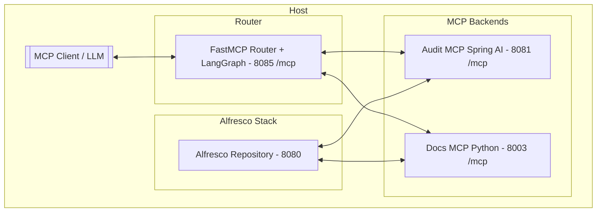

# Simple Alfresco Agent Mesh

A minimal stack that spins up:

* Alfresco Community Repository including Audit sample configuration
* Two MCP servers:
  * Audit MCP
    * Spring AI, streamable HTTP (exposes audit-centric tools)
    * Source code available in https://github.com/jottley/alfresco-mcp
  * Docs MCP
    * Python `alfresco-mcp` server (content/doc tools)
    * Source code available in https://github.com/stevereiner/python-alfresco-mcp-server
* An MCP Router/Orchestrator: tiny Python service built with **FastMCP** & **LangGraph** that classifies the user prompt and forwards the MCP call to the right backend (*audit* vs *docs*)

Designed to be easy to run locally, easy to understand, and a good template for building more sophisticated Agent Meshes

## Architecture



* The **Router** is the single MCP endpoint for clients
* It *classifies* each request and *delegates* to either the **Audit MCP** or **Docs MCP** backend over Streamable HTTP
* Both backends talk to **Alfresco**

## What’s included

* Alfresco Docker Compose (full stack) under `alfresco/`
* Audit MCP (Java/Spring AI) under `alfresco-mcp-audit/`
* Docs MCP (Python `alfresco-mcp`) under `alfresco-mcp-server/`
* Router (FastMCP + LangGraph) under `orchestrator/`
* Optional *CLI client* setup under `mcp-client-cmd/` to chat with the router using `mcp-cli`

Root `compose.yaml` includes the three services needed for the mesh plus Alfresco

## Quick start

**Prereqs**

* Docker & Docker Compose
* \~10–12 GB RAM free recommended (ACS + DB + MQ + search + 3 small services)
* Ollama using `gpt-oss` LLM

1) Bring the mesh up

```bash
docker compose up --build
```

This starts:

* Alfresco stack
* Audit MCP on `:8081`
* Docs MCP on `:8003`
* Router on `:8085` (Streamable HTTP at `/mcp`)

2) Talk to the Router (optional CLI container)

```bash
docker compose -f mcp-client-cmd/compose.yaml run --rm mcp-client
```

The container runs `mcp-cli` and points to the router via `server_config.json`.
If you use **Ollama** locally, the client image forwards `127.0.0.1:11434` inside the container so “local” tools work.

## Project layout

```
.
├─ compose.yaml                  # root compose (includes the services below)
├─ orchestrator/                 # FastMCP + LangGraph router
│  ├─ router_server.py
│  ├─ Dockerfile
│  └─ compose.yaml               # exposes :8085 /mcp
├─ alfresco-mcp-audit/           # Spring AI server (Audit MCP)
│  ├─ Dockerfile
│  ├─ compose.yaml               # exposes :8081 /mcp
│  └─ pom.xml                    # build fix for upstream repo
├─ alfresco-mcp-server/          # Python alfresco-mcp (Docs MCP)
│  ├─ Dockerfile
│  ├─ .env                       # ALFRESCO_URL, creds, transport, etc.
│  └─ compose.yaml               # exposes :8003 /mcp
├─ alfresco/                     # ACS full stack
│  ├─ compose.yaml
│  └─ .env
└─ mcp-client-cmd/               # optional CLI client to chat with router
   ├─ Dockerfile
   ├─ compose.yaml
   └─ server_config.json
```

Root `compose.yaml`:

```yaml
include:
  - orchestrator/compose.yaml
  - alfresco-mcp-audit/compose.yaml
  - alfresco-mcp-server/compose.yaml
  - alfresco/compose.yaml
```

## Health & endpoints

* Router: `http://localhost:8085/mcp`
* Audit MCP: `http://localhost:8081/mcp`
* Docs MCP: `http://localhost:8003/mcp`
* Alfresco: `http://localhost:8080`

## How the router works (LangGraph)

### Classification logic

The router is a **tiny FastMCP server** that **proxies tools** from two backends (namespaced) and uses a **LangGraph `StateGraph`** to decide where to send each request

Key ideas from `orchestrator/router_server.py`:

1. Backends and namespaces

   * Two backends are registered: `audit` and `docs`
   * When proxied, tools are **prefixed** (e.g., `audit_getEvents`, `docs_findDocument`), making discovery & filtering trivial

2. Lightweight classifier (regex + heuristics)

   * Regex patterns score the prompt toward one backend:
     * Audit patterns: look for verbs/phrases like *“who deleted/modified”*, *“show activities/logs”*, *“permission changed”*, *“login/logout”*, *“compliance report”*, etc.
     * Docs patterns: look for *“find/search document/file”*, *“download/upload/share”*, *“generate rendition/preview”*, *“metadata/properties of”*, *“list documents/folders”*, etc.
   * Question indicators** bias routing:
     * `who`, `when` > often audit
     * `where`, `how` > often docs
     * `what`, `why` > neutral
   * Fallback heuristics if nothing matches strongly:
     * Length: longer queries lean *docs* (content search/exploration)
     * Action verbs: `show/list/get` > *audit*; `find/search/locate` > *docs*

   The classifier returns a structured result: `{guess: "audit"|"docs", confidence, reason, matched_patterns[]}`. The router attaches this to the MCP trace for debugging

3. LangGraph flow

   * Graph nodes: `START > classify > (audit|docs) > END`
   * The *classify* node runs the regex/heuristics, chooses a *target namespace*, and the *delegate* node forwards to the matching backend (via FastMCP proxy)
   * If confidence is low (or a backend is down), the router can fall back or surface an actionable error

4. Tooling for introspection

   * `list_backend_tools`: lists all proxied tool names by backend
   * `which_backend`: shows which URLs the router is pointing to

Example prompts and likely routing:

```
[DOCS]

> I need to search for documents in Alfresco. Can you search for:
- Documents containing "budget"
- Maximum 5 results

[AUDIT]

> List Alfresco audit apps
> List Alfresco audit entries for audit app "search"
```

## Troubleshooting

Router returns connection or 5xx errors

* Check backends are up:

  * Audit MCP: `curl -s http://localhost:8081/actuator/health` (expect `"status":"UP"`)
  * Docs MCP: `curl -s http://localhost:8003/mcp` (should handshake)
* Verify router env vars: `AUDIT_MCP_URL`, `DOCS_MCP_URL`.

Client can’t reach router

* Confirm it’s bound to `0.0.0.0:8085` and your client points to `http://localhost:8085/mcp`

Ollama not visible inside the CLI container

* On macOS/Windows you usually have `host.docker.internal`
* On Linux, add:

  ```yaml
  extra_hosts:
    - "host.docker.internal:host-gateway"
  ```

  Or point the client directly to your host IP.

Alfresco login fails

* Recheck `alfresco/.env`. If you changed the admin password, update it everywhere (Audit/Docs MCP env too).

## License

This repository is provided under the **Apache 2.0** license (see `LICENSE`).
Upstream components maintain their own licenses.